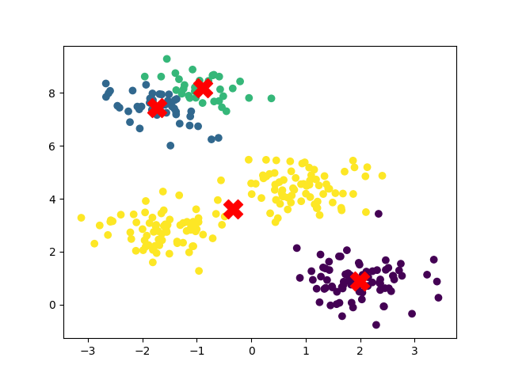

# K-Means Clustering from Scratch

This repository contains an implementation of the **K-Means clustering algorithm** from scratch using NumPy. The algorithm is demonstrated on synthetic 2D data generated using `make_blobs`, and results are visualized using Matplotlib.

---

## 🚀 Getting Started

1. Clone the repository:
   ```bash
   git clone https://github.com/boogen/ml-course.git
   cd ml-course/kmeans
   ```

2. Set up a virtual environment and install dependencies:
   ```bash
   python3 -m venv venv && source venv/bin/activate
   pip3 install -r requirements.txt
   ```

3. Run the script:
   ```bash
   python3 model.py
   ```

---

## 🧠 Algorithm Overview

K-Means is an **unsupervised learning algorithm** that partitions data into `k` clusters by minimizing the variance within each cluster.

### ✅ Features

- Custom implementation using NumPy
- K-Means++ initialization for better centroid selection
- Convergence based on centroid movement tolerance
- Visualization of final clusters and centroids

---

## 📊 Example Output

The example generates 300 samples in 4 clusters and fits the K-Means algorithm:



---

## ⚙️ Code Highlights

- K-Means++ initialization chooses initial centroids based on weighted probabilities to improve convergence and clustering quality
- Cluster assignment is performed using Euclidean distance
- Iterative updates continue until centroids stabilize within a tolerance threshold
- Final result is visualized with distinct colors for clusters and red 'X' for centroids

---

## 🧑‍💻 Author

Created by Marcin Bugala as a hands-on exercise in building machine learning algorithms from scratch.  
This project is intended for learning and exploration
