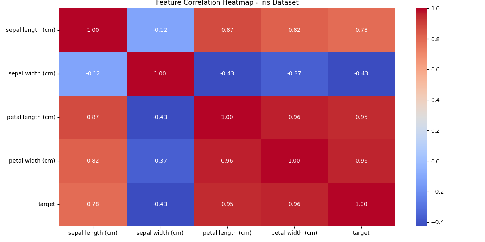

# KNN Classifier Implementation

This repository contains an implementation of the K-Nearest Neighbors (KNN) classifier from scratch, using the Iris dataset. The project includes both a custom KNN implementation and a comparison with the popular Scikit-learn KNN implementation.

---

## 🚀 Getting Started

1. Clone the repository:
  ```bash
  git clone https://github.com/boogen/ml-course.git
  cd ml-course/knn
  ```


2. Install dependencies in a virtual environment
  ```bash
  python3 -m venv venv && source venv/bin/activate
  pip3 install -r requirements.txt
  ```
  
3. Run the script:
  ```bash
  python3 model.py
  ```
---

## 🧹 Data Exploration

### 🔥 Correlation Heatmap

Shows how numeric features relate to each other:



---

## 📈 Result

KNN Classifier Accuracy: **0.98**
SKLearn KNN Accuracy: **0.98**

---

## 🧑‍💻 Author

Created by Marcin Bugala as a hands-on exercise in building machine learning algorithms from scratch.  
This project is intended for learning and exploration