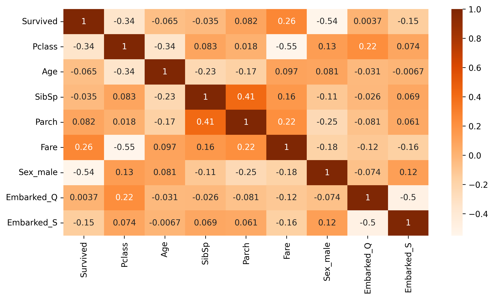
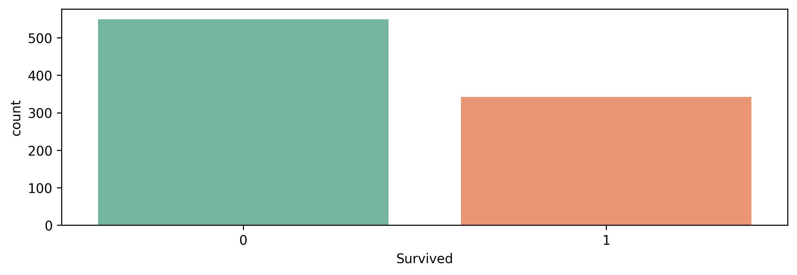
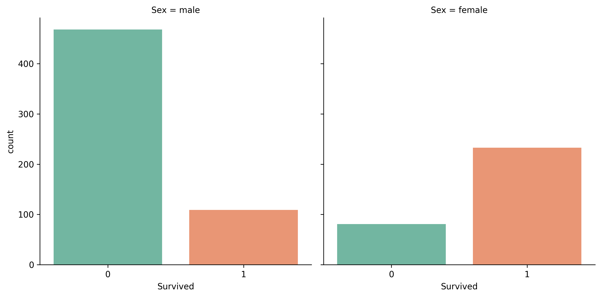
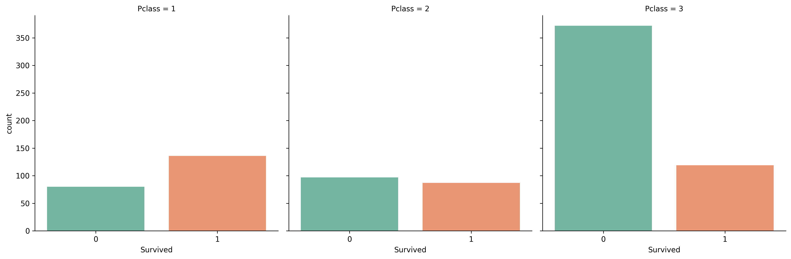
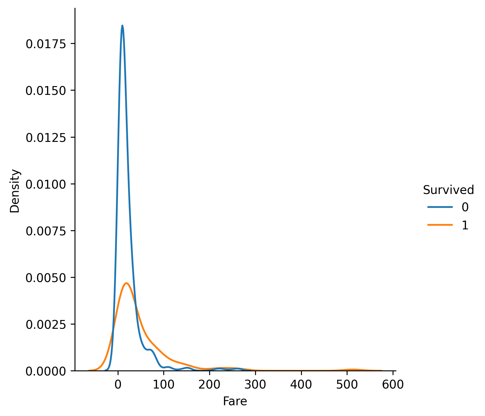

# 🧠 Titanic Survival Prediction with Logistic Regression

This project implements **logistic regression from scratch using NumPy** to predict survival on the Titanic dataset. It includes data preprocessing, feature selection, model training, evaluation, and visual analysis of the dataset.

---

## 📊 Dataset

The dataset is from the [Kaggle Titanic competition](https://www.kaggle.com/c/titanic/data) and contains information about passengers such as age, sex, class, fare, and whether they survived.

---

## 🚀 Getting Started

1. Clone the repository:
  ```bash
  git clone https://github.com/boogen/ml-course.git
  cd ml-course/logistic-regression
  ```


2. Install dependencies in a virtual environment
  ```bash
  python3 -m venv venv && source venv/bin/activate
  pip3 install -r requirements.txt
  ```
  
3. Run the script:
  ```bash
  python3 titanic.py
  ```
---

## 📊 Features Used

The model uses the following features from the Titanic dataset:

- `Pclass` – Ticket class (1st, 2nd, 3rd)
- `Sex` – Gender (encoded as 0/1)
- `Age` – Age of passenger (missing values filled with median)
- `SibSp` – Number of siblings/spouses aboard
- `Parch` – Number of parents/children aboard
- `Fare` – Price paid for the ticket
- `Embarked` – Port of embarkation (S, C, Q; filled with mode and encoded)

---

## 🧹 Data Exploration

### 🔥 Correlation Heatmap

Shows how numeric features relate to each other and to survival:
```python
  plt.figure(figsize=(10, 5))
  sns.heatmap(train_data_num.corr(), annot=True, cmap='Oranges');
  plt.savefig('correlation_heatmap.png', dpi=300, bbox_inches='tight')
  plt.close()
```


---

### 🧍 Survival Counts

Number of passengers who survived vs. did not:
```python
  plt.figure(figsize=(10, 3))
  sns.countplot(x = "Survived",data=train_data, palette="Set2")
  plt.savefig('survived.png', dpi=300, bbox_inches='tight')
  plt.close()
```


---

### 👩 vs 👨 Survival by Sex

Women had a significantly higher survival rate than men:
```python
  plt.figure(figsize=(10, 3))
  sns.catplot(x='Survived', col='Sex', kind='count', data=train_data,palette="Set2");
  plt.savefig('survived_by_sex.png', dpi=300, bbox_inches='tight')
  plt.close()
```


---

### 🛏️ Survival by Class

1st class passengers were more likely to survive:
```python
  plt.figure(figsize=(10, 3))
  sns.catplot(x='Survived', col='Pclass', kind='count', data=train_data,palette="Set2");
  plt.savefig('survived_by_pclass.png', dpi=300, bbox_inches='tight')
  plt.close()
```


---

### 💰 Fare Distribution

Distribution of fares colored by survival:
```python
  plt.figure(figsize=(10, 3))
  sns.displot(data=train_data, x="Fare",hue='Survived',kind ='kde')
  plt.savefig('survived_by_fare.png', dpi=300, bbox_inches='tight')
  plt.close()
```


---

## 📈 Model

- Logistic Regression implemented **from scratch using NumPy**
- Data preprocessing includes:
  - Filling missing values
  - One-hot encoding categorical variables (`Sex`, `Embarked`)
  - Scaling with `RobustScaler`
- Model trained using **batch gradient descent**
- Used **sigmoid activation** and **binary cross-entropy loss gradient**
- Achieved accuracy:
  - ✅ **Best: 78.77%** with `random_state=273`
  - ❌ **Worst: 58.66%** with `random_state=257`
  - Accuracy varies depending on the train/test split


---

## 🛠️ Requirements

Install dependencies:

```bash
pip install numpy pandas matplotlib seaborn scikit-learn
```

---

## 🧑‍💻 Author

Created by Marcin Bugala as a hands-on exercise in building machine learning algorithms from scratch.  
This project is intended for learning and exploration
