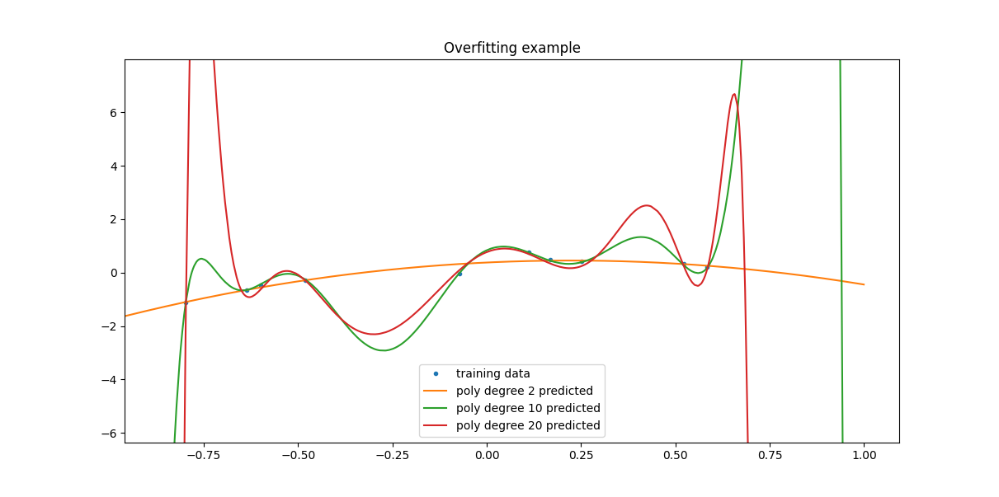

# 🧠 Polynomial Regression with Regularization

This project implements polynomial regression from scratch in Python using NumPy, with support for L2 regularization (Ridge Regression). It also includes a utility for generating synthetic datasets using various underlying functions and visualizing model performance.

## Features

- Polynomial feature expansion
- Gradient descent training with L2 regularization
- Closed-form solution with Ridge regularization
- Custom dataset generation with noise
- Visualization of fitted models

---

## 🚀 Getting Started

1. Clone the repository:
  ```bash
  git clone https://github.com/boogen/ml-course.git
  cd ml-course/ridge_regression
  ```


2. Install dependencies in a virtual environment
  ```bash
  python3 -m venv venv && source venv/bin/activate
  pip3 install -r requirements.txt
  ```
  
3. Run the script:
  ```bash
  python3 model.py
  ```
---

## 📈 Usage

### 1. Dataset Generation

The `gen_data` function creates training and testing datasets based on a selected function (`poly1`, `poly2`, `log`, or `sin`) with Gaussian noise.

```python
X_train, Y_train = gen_data(N=10, fun='poly2', sigma_noise=0.2)
X_test, Y_test = gen_data(N=1000, fun='poly2', sigma_noise=0.2)
```

### 2. Model Training

Use the `PolyRegression` class to train a polynomial regression model either via:

- Gradient Descent (`fit`)
- Closed-form solution with regularization (`solve`)

```python
model = PolyRegression(degree=10, epochs=5000, learning_rate=0.01, reg_lambda=0.05)
model.solve(X_train, Y_train)
```

### 3. Visualization

```python
plt.plot(X_train, Y_train, '.', label='training data')
for degree in [2, 10, 20]:
    model = PolyRegression(degree, epochs=5000, learning_rate=0.01, reg_lambda=0.05).solve(X_train, Y_train)
    plt.plot(X_test, model.predict(X_test), '-', label=f'poly degree {degree} predicted')
plt.title('Small dataset with noise and model with regulation')
plt.legend(bbox_to_anchor=(1.05, 1), loc='upper left')
plt.show()
```

---

## 📊 Model Exploration

### Square function with 1000 samples

We generate data from a square function ('poly2'), without noise and with 1000 samples. Regular linear regression model handles this well. 0 and 1st degree functions are underfitting, but that is expected.


---

### Overfitting - square function with 10 samples

When we reduce the number of samples, the higher degree polynomials start to overfit the data



---

### Regularization - square function with 10 samples

To counter that we introduce regulation term.


---

## Model API

### `PolyRegression(degree, epochs=5000, learning_rate=0.05, reg_lambda=0.0)`

- `degree`: Degree of the polynomial.
- `epochs`: Number of training epochs for gradient descent.
- `learning_rate`: Learning rate for gradient descent.
- `reg_lambda`: Regularization strength (L2).

### Methods

- `fit(X, y)`: Trains the model using gradient descent.
- `solve(X, y)`: Computes weights using closed-form ridge regression.
- `predict(X)`: Predicts output for given input.
- `loss(X, y)`: Computes MSE loss with regularization.

---

## 🧑‍💻 Author

Created by Marcin Bugala as a hands-on exercise in building machine learning algorithms from scratch.  
This project is intended for learning and exploration
